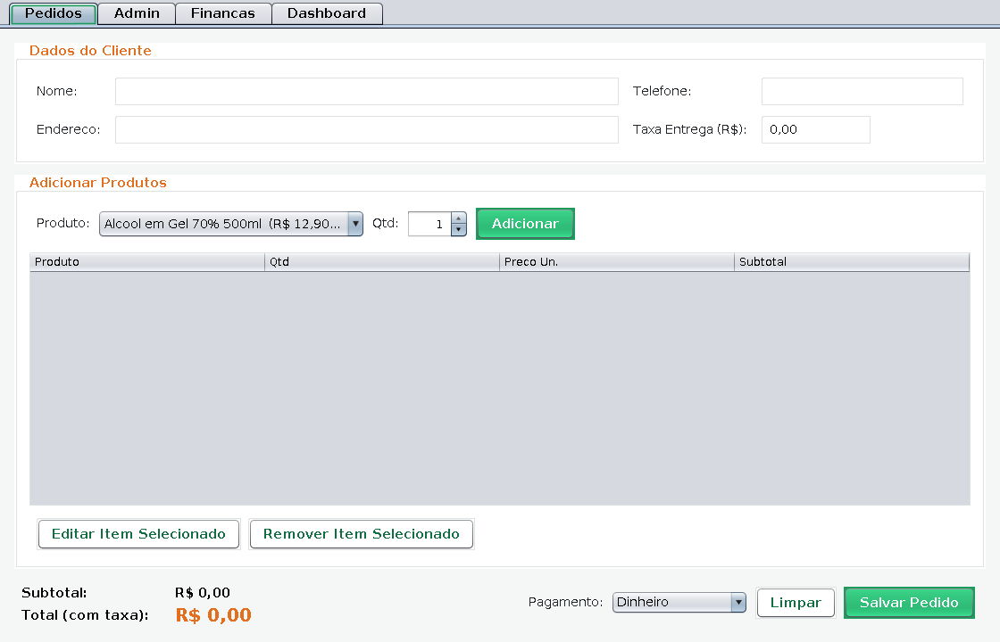
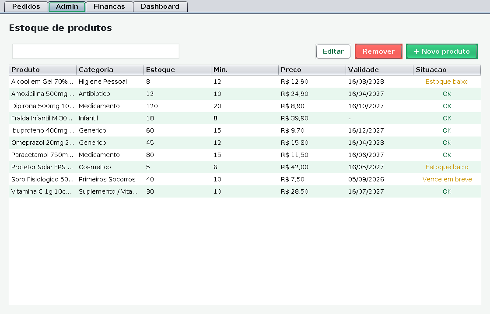
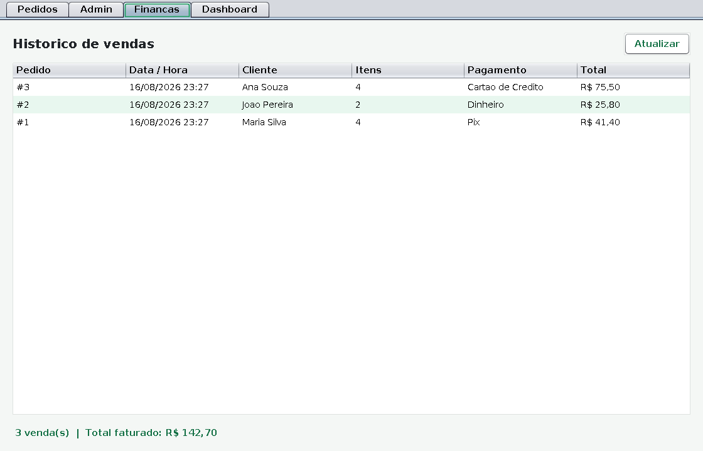
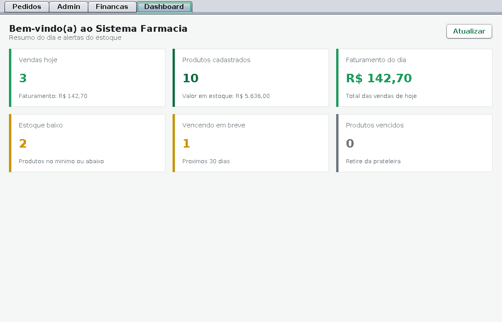

# 💊 Sistema Farmácia — Gestão e PDV (Desktop)

[](https://github.com/juceliocoelho2022/farmacia-manager/actions/workflows/ci.yml)


Aplicativo **desktop em Java (Swing)** para uma farmácia gerenciar o dia a dia:
controle de **estoque**, **ponto de venda (PDV)**, **histórico de vendas** e um
**painel com alertas** (estoque baixo e produtos vencendo).

Foi feito para ser instalado no **PC do balconista/dono** como um programa comum
do Windows (**instalador `.exe`**), sem precisar de internet nem de banco de
dados externo — os dados ficam salvos localmente na própria máquina.

> Projeto **independente** e autocontido: não usa banco de dados, não precisa
> de internet e só depende da biblioteca padrão do Java.

---

## 📸 Telas

### Pedidos — cliente, taxa de entrega e itens do pedido


### Admin — controle de estoque com alertas por situação


### Finanças — histórico de pedidos e total faturado


### Dashboard — resumo do dia e alertas


---

## ✨ Funcionalidades

Organizado em 4 abas: **Pedidos · Admin · Finanças · Dashboard**.

| Aba | O que faz |
|--------|-----------|
| **Pedidos** | Registra o pedido: **dados do cliente** (nome, telefone, endereço), **taxa de entrega**, adiciona produtos, edita/remove itens, escolhe a forma de pagamento e **salva o pedido** dando **baixa automática no estoque**. |
| **Admin** | Cadastra, edita, remove e busca produtos (nome, categoria, fabricante, código de barras, preços de custo/venda, quantidade, estoque mínimo, validade e se exige receita). |
| **Finanças** | Histórico de todos os pedidos, total faturado e detalhamento item a item (duplo clique no pedido). |
| **Dashboard** | Vendas e faturamento do dia, total de produtos, valor em estoque e alertas de estoque baixo / vencimento. |

Regras de negócio já tratadas: não vende acima do estoque disponível, valida
código de barras duplicado, sinaliza produtos vencidos e próximos do
vencimento (30 dias) e nunca deixa o total da venda ficar negativo.

Na **primeira execução** o sistema já vem com **10 produtos de exemplo** para
você testar o PDV imediatamente.

---

## 🗂️ Onde os dados ficam salvos

Os dados são gravados automaticamente em arquivos, na pasta do usuário:

- **Windows:** `%APPDATA%\SistemaFarmacia\` (ex.: `C:\Users\SeuNome\AppData\Roaming\SistemaFarmacia`)
- **Linux/macOS:** `~/.sistema-farmacia/`

Arquivos: `medicamentos.dat` (catálogo/estoque) e `vendas.dat` (histórico).
Para fazer **backup**, basta copiar essa pasta.

---

## ▶️ Como rodar rapidamente (para testar)

Requer **Java 17 ou superior** instalado (`java -version`).

**Linux/macOS:**
```bash
cd pharmacy-desktop
./build.sh      # gera dist/SistemaFarmacia.jar
./run.sh        # abre o programa
```

**Windows:**
```bat
cd pharmacy-desktop
build.bat
java -jar dist\SistemaFarmacia.jar
```

---

## 📦 Como gerar o instalador `.exe` (para o PC do cliente)

O instalador é gerado com o **`jpackage`** (já incluso no JDK 17+). Ele precisa
ser executado **em uma máquina Windows**, pois o `.exe` é um binário do Windows.

**Pré-requisitos no Windows:**
1. **JDK 17+** instalado e no `PATH` (fornece o `jpackage`).
2. **WiX Toolset 3.x** instalado — necessário para o `jpackage` montar o `.exe`:
   https://github.com/wixtoolset/wix3/releases

**Passos:**
```bat
cd pharmacy-desktop
build.bat                 REM 1) gera o JAR
package-windows.bat       REM 2) gera o instalador .exe
```

O instalador aparecerá em `dist-installer\SistemaFarmacia-1.0.exe`. Ao instalar,
ele cria atalho no Menu Iniciar e na Área de Trabalho. **O cliente não precisa
ter Java instalado** — o `jpackage` embute o Java junto com o aplicativo.

> Dica: para gerar um pacote sem depender do WiX, troque `--type exe` por
> `--type app-image` no `package-windows.bat`. Isso gera uma **pasta portátil**
> com o `SistemaFarmacia.exe` dentro, que roda sem instalação.

---

## ✅ Testes

Lógica de negócio coberta por **testes de unidade (JUnit 5)**:

```bash
cd pharmacy-desktop
./test.sh
```

Cobrem cadastro/validação de produtos, ajuste e alertas de estoque, e o
registro de vendas com baixa de estoque (13 testes).

---

## 🏗️ Arquitetura

Separação em camadas, sem dependências externas em produção (apenas a
biblioteca padrão do Java), o que mantém o instalador leve:

```
com.farmacia
├─ model/           Modelos de domínio (Medicamento, Venda, ItemVenda, ...)
├─ repository/      Contratos de persistência
│   ├─ memoria/     Implementação em memória (usada nos testes)
│   └─ arquivo/     Persistência em arquivo (serialização Java)
├─ service/         Regras de negócio (EstoqueService, VendaService, Dashboard)
├─ ui/              Interface gráfica Swing (painéis, tabelas, tema)
├─ ContextoAplicacao  Montagem das dependências (repos + serviços)
├─ SeedDados          Catálogo de exemplo da primeira execução
└─ Main               Ponto de entrada
```

- **Interface (Swing)** conversa apenas com a camada de **serviço**.
- **Serviço** aplica as regras e usa os **repositórios** por meio de interfaces.
- **Repositórios** trocam facilmente entre memória (testes) e arquivo (produção).

---

## 🔧 Stack

- **Java 17+** • **Swing** (interface gráfica) • **JUnit 5** (testes)
- **jpackage** + **WiX** para o instalador `.exe`
- Persistência local por serialização (sem banco de dados)

---

## 📄 Licença

Distribuído sob a licença **MIT**. Veja o arquivo [`LICENSE`](LICENSE) para mais
detalhes.
